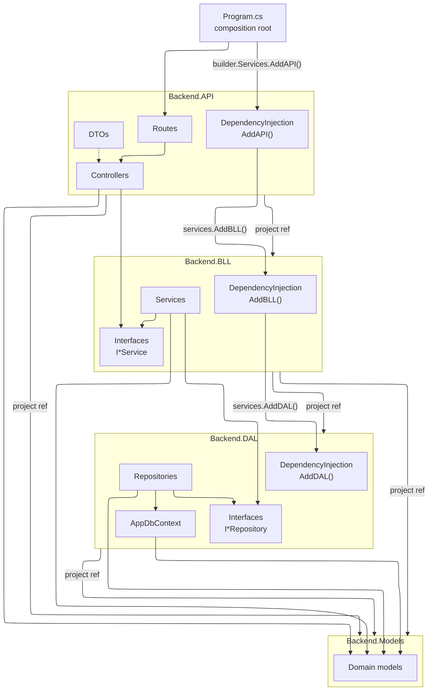

```mermaid
---
config:
  theme: default
  look: classic
  layout: elk
---
flowchart TB
    subgraph API["Backend.API"]
        Routes["Routes"]
        Controllers["Controllers"]
        DTOs["DTOs"]
        ApiDI["DependencyInjection<br/>AddAPI()"]
    end

    subgraph BLL["Backend.BLL"]
        ServiceInterfaces["Interfaces<br/>I*Service"]
        Services["Services"]
        BllDI["DependencyInjection<br/>AddBLL()"]
    end

    subgraph DAL["Backend.DAL"]
        RepoInterfaces["Interfaces<br/>I*Repository"]
        Repositories["Repositories"]
        DbContext["AppDbContext"]
        DalDI["DependencyInjection<br/>AddDAL()"]
    end

    subgraph Models["Backend.Models"]
        DomainModels["Domain models"]
    end

    Program["Program.cs<br/>composition root"]

    Program -->|"builder.Services.AddAPI()"| ApiDI
    ApiDI -->|"services.AddBLL()"| BllDI
    BllDI -->|"services.AddDAL()"| DalDI
    Program --> Routes

    Routes --> Controllers
    Controllers --> ServiceInterfaces
    Services --> ServiceInterfaces
    Services --> RepoInterfaces
    Repositories --> RepoInterfaces
    Repositories --> DbContext

    Controllers --> DomainModels
    Services --> DomainModels
    Repositories --> DomainModels
    DbContext --> DomainModels
    DTOs -.-> Controllers

    API -->|"project ref"| BLL
    API -->|"project ref"| Models
    BLL -->|"project ref"| DAL
    BLL -->|"project ref"| Models
    DAL -->|"project ref"| Models
```
